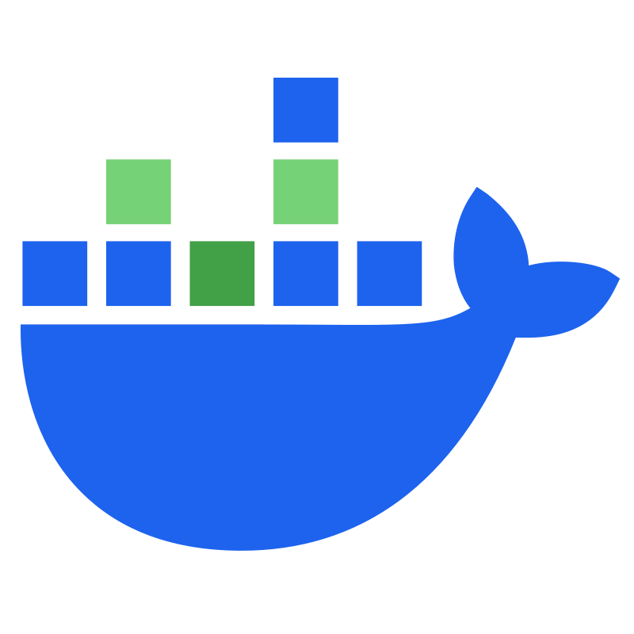

<!-- markdownlint-capture -->
<!-- markdownlint-disable MD013 MD033 MD041 -->

    

<!-- markdownlint-restore -->

# `bzldocker`

Multi-platform (`amd64`, `arm64`) Bazel Docker images.

## ✨ Features

* Debian based
* Multi-platform: `amd64`, `arm64`
* `nonroot` user
* Bazelisk with Bazel cached
* Uses [reproducible-containers/repro-sources-list.sh] for installing packages
  from a snapshot to help [Reproducible Builds].

## 🍧 Image "flavors"

A "flavor" is a type of image. Flavors define variations of the base image,
layering additional tools and configurations to support different use cases.

Each image flavor corresponds to a specific [Docker named build stage] (`FROM
... AS <name>`) in the [`Dockerfile`]. Each stage builds on the previous one to
create incremental images:

* [`debian`]: the base image, with Bazelisk and Bazel installed and cached.
* [`debian-cc`]: adds `gcc` and `g++` for C/C++ toolchains.
* [`debian-debug`]: adds useful debugging and interactive tools, including
  shell enhancements like autocompletion.
* [`debian-docker`]: installs Docker, enabling workflows such as [DooD (Docker
  outside of Docker)].

## 🧱 Building

The images are built with the `build-docker-images` [Github Actions workflow].
The workflow builds the images, pushes them to the GHCR registry and links them
with the repo. See the [`docs/`] directory for more details.

## 💡 Contributing

Please feel free to open [issues] and [PRs], contributions are always welcome!
See [CONTRIBUTING.md] for more info on how to work with this repo.

[CONTRIBUTING.md]: CONTRIBUTING.md
[`Dockerfile`]: ../../blob/main/Dockerfile
[Docker named build stage]: https://docs.docker.com/build/building/multi-stage/#name-your-build-stages
[DooD (Docker outside of Docker)]: https://www.nixknight.com/2022/01/dind-vs-dood/
[Github Actions workflow]: https://docs.github.com/actions
[PRs]: ../../pulls
[Reproducible Builds]: https://reproducible-builds.org
[`debian`]: ../../pkgs/container/bzldocker%2Fdebian
[`debian-cc`]: ../../pkgs/container/bzldocker%2Fdebian-cc
[`debian-debug`]: ../../pkgs/container/bzldocker%2Fdebian-debug
[`debian-docker`]: ../../pkgs/container/bzldocker%2Fdebian-docker
[`docs/`]: docs/README.md
[issues]: ../../issues
[reproducible-containers/repro-sources-list.sh]: https://github.com/reproducible-containers/repro-sources-list.sh
